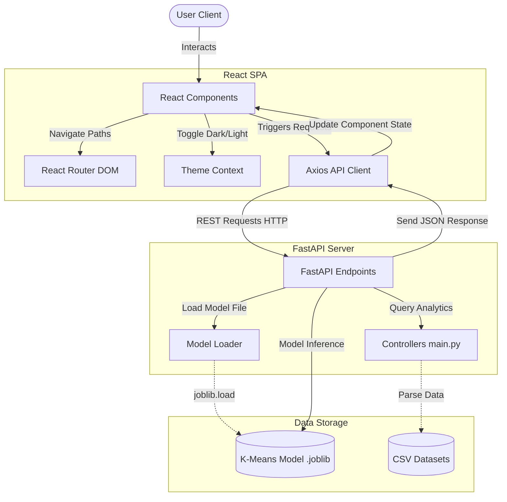

# Customer Segmentation System

[](https://www.python.org/)
[](https://fastapi.tiangolo.com/)
[](https://react.dev/)
[](https://vite.dev/)
[](https://scikit-learn.org/)
[](LICENSE)

An intelligent, production-ready Customer Relationship Management (CRM) analytical dashboard that aggregates transaction records and classifies customers into behavior-driven segments using machine learning.

---

## 1. Project Overview

The Customer Segmentation System solves a critical business challenge: identifying and grouping customers based on purchasing patterns to optimize marketing expenditures, improve retention rates, and drive revenue growth.

The system uses **Recency, Frequency, and Monetary (RFM)** features to train an unsupervised **K-Means clustering** model. The backend is powered by **FastAPI** to load the model and calculate real-time predictions, while the frontend is built using **React 18** and **Vite** to provide a clean dashboard UI.

---

## 2. Key Features

*   **Interactive Dashboard**: Displays real-time statistics (Total Customers, Total Segments, Average Recency, Average Spend) and dynamic customer charts.
*   **Customer Lookup Search**: Allows users to retrieve individual profiles and transaction values by Customer ID.
*   **Customer Profile Details**: Evaluates transaction recency to assign dynamic relationship status categories (Active, Recent, Inactive, Dormant) and suggests marketing actions.
*   **Real-time Segment Prediction**: Predicts customer segment classification using real-time inputs.
*   **Centralized Axios client**: Uses interceptors for authorization headers and error handling.
*   **Theme Context System**: Supports Light and Dark modes, persisting preferences in `localStorage`.
*   **Responsive layouts**: Designed with fluid grids that adapt to desktop, tablet, and mobile viewports.

---

## 3. Technology Stack

| Layer | Technology | Primary Role |
| :--- | :--- | :--- |
| **Frontend** | React 18, React Router 6, Axios | View UI pages, routing navigation, API fetching. |
| **Backend** | FastAPI, Uvicorn, Pydantic | REST API routing, input schema validation, startup tasks. |
| **Machine Learning** | Scikit-Learn, Pandas, NumPy, Joblib | Data scaling (StandardScaler), K-Means model inference, dataset parsing. |
| **Development Tools** | Vite, Git, Node.js, PowerShell | Compilation bundling, version control, runtime environment. |

---

## 4. Project Architecture



---

## 5. Folder Structure

```
customer-segmentation/
├── backend/                # Python backend API application files
│   ├── app/                # Main FastAPI execution scripts and controllers
│   │   ├── main.py         # App entrypoint and routes definitions
│   │   ├── model_loader.py # Deserialization script using joblib
│   │   ├── schemas.py      # Input validation schemas (Pydantic)
│   │   ├── dashboard.py    # Aggregation statistics calculations
│   │   ├── customer_search.py # Individual customer lookup query
│   │   └── customer_details.py # Profiles details calculations
│   └── requirements.txt    # Python package dependencies manifest
├── frontend/               # React + Vite frontend source code
│   ├── src/                # Layouts, components, styles, services, contexts
│   └── package.json        # Frontend Node dependencies manifest
├── datasets/               # Reference datasets (customer_rfm.csv, customer_segments_labeled.csv)
├── models/                 # Serialized K-Means clustering models (.joblib)
├── screenshots/            # UI screenshots for visual reference
├── tests/                  # Test suites directories
└── docs/                   # System architectural and markdown documentation files
```

---

## 6. Screenshots Section

Below are placeholders for the UI views:

#### Light Mode Dashboard


#### Dark Mode Dashboard


#### Prediction Panel


#### Customer Lookup Profile


#### Detailed Customer Profile


---

## 7. Installation Guide

Follow these steps to run the application locally:

### Prerequisites
*   Python 3.10+
*   Node.js 18.0+
*   Git 2.30+

### Step 1: Clone the Repository
```bash
git clone https://github.com/ML-Projects/customer-segmentation.git
cd customer-segmentation
```

### Step 2: Configure the Backend Environment
1.  Create a virtual environment:
    ```bash
    python -m venv .venv
    ```
2.  Activate the virtual environment:
    *   **Windows (PowerShell)**:
        ```powershell
        .venv\Scripts\Activate.ps1
        ```
    *   **macOS / Linux**:
        ```bash
        source .venv/bin/activate
        ```
3.  Install backend dependencies:
    ```bash
    cd backend
    pip install -r requirements.txt
    cd ..
    ```

### Step 3: Configure the Frontend Environment
1.  Navigate to the frontend directory:
    ```bash
    cd frontend
    ```
2.  Install frontend dependencies:
    ```bash
    npm install
    cd ..
    ```

---

## 8. Running the Project

Run the backend and frontend in separate terminal windows:

### Run the Backend (FastAPI)
```bash
cd backend
uvicorn app.main:app --reload --port 8000
```
Verify the backend is running by opening `http://127.0.0.1:8000/health` in your browser.

### Run the Frontend (React + Vite)
```bash
cd frontend
npm run dev
```
Open your browser and navigate to `http://localhost:5173/` to use the application.

---

## 9. API Endpoints

| HTTP Method | Endpoint | Input | Success Response (200 OK) |
| :--- | :--- | :--- | :--- |
| `GET` | `/health` | None | `{ "backend": "running", "model": "loaded", "version": "1.0.0" }` |
| `GET` | `/model-info` | None | `{ "model_loaded": true, "algorithm": "KMeans", "clusters": 4 }` |
| `GET` | `/dashboard` | None | Aggregated averages, customer count, and segment distribution percentages. |
| `POST` | `/predict` | JSON RFM payload | `{ "cluster": 3, "segment": "Premium Customers" }` |
| `GET` | `/customer/{id}` | Path Customer ID | Target customer stats, cluster assignment, and segment label. |
| `GET` | `/customer-details/{id}` | Path Customer ID | Customer profile values and dynamic status tag. |

---

## 10. Customer Segments Classification

The K-Means algorithm partitions the customer base into four clusters based on standardized RFM values:

| Centroid Cluster | Segment Name | RFM Characteristics | Business Strategy |
| :--- | :--- | :--- | :--- |
| **Cluster 0** | **Regular Customers** | Average recency, frequency, and spend. | Retain with regular newsletters and seasonal promotions. |
| **Cluster 1** | **At Risk Customers** | High recency (dormant period), low frequency, and low spend. | Deploy high-value winback coupons and customer surveys. |
| **Cluster 2** | **VIP Customers** | Low recency (active recently), high frequency, and high monetary spend. | Reward with exclusive VIP loyalty tiers and early access. |
| **Cluster 3** | **Premium Customers** | Moderate recency, moderate frequency, and high monetary spend. | Offer upsell opportunities and premier program upgrades. |

---

## 11. Testing Summary

The system has passed all integration, validation, and functional verification tests:
*   **Functional Verification**: Validates search queries, route transitions, and theme triggers (**PASS**).
*   **Validation Testing**: Rejects negative, empty, or non-numeric inputs using client and server validation checks (**PASS**).
*   **Error Catching**: Gracefully handles 404 (not found), 422 (validation errors), 500 (internal error), and 503 (service unavailable) responses (**PASS**).
*   **CORS Configuration**: Configured allowed origins to authorize requests from localhost ports 5173 and 5174 (**PASS**).
*   **Responsive Viewports**: Fluid grids adjust to desktop, tablet, and mobile displays (**PASS**).
*   **Performance Metrics**: Dashboard aggregation latency is under 100ms, and prediction time is under 5ms (**PASS**).

---

## 12. System Documentation

For detailed information, refer to the following documentation files in the `docs/` directory:

1.  [docs/PROJECT_ARCHITECTURE.md](file:///d:/ML-Projects/customer-segmentation/docs/PROJECT_ARCHITECTURE.md): Structural workflow analysis and Mermaid system flowcharts.
2.  [docs/BACKEND_DOCUMENTATION.md](file:///d:/ML-Projects/customer-segmentation/docs/BACKEND_DOCUMENTATION.md): Controller configurations, module definitions, and FastAPI startup configurations.
3.  [docs/FRONTEND_DOCUMENTATION.md](file:///d:/ML-Projects/customer-segmentation/docs/FRONTEND_DOCUMENTATION.md): Component structures, layouts, context systems, and responsive designs.
4.  [docs/API_DOCUMENTATION.md](file:///d:/ML-Projects/customer-segmentation/docs/API_DOCUMENTATION.md): HTTP path variables, JSON payload structures, and success/error responses.
5.  [docs/MODEL_DOCUMENTATION.md](file:///d:/ML-Projects/customer-segmentation/docs/MODEL_DOCUMENTATION.md): Preprocessor standardizer equations and training algorithms.
6.  [docs/USER_GUIDE.md](file:///d:/ML-Projects/customer-segmentation/docs/USER_GUIDE.md): Step-by-step installation guides and troubleshooting steps.
7.  [docs/TESTING_REPORT.md](file:///d:/ML-Projects/customer-segmentation/docs/TESTING_REPORT.md): Quality assurance check summaries and functional verification test cases.

---

## 13. Future Improvements

*   **OAuth2 / JWT Authentication**: Secure endpoints with token authorization.
*   **Relational Database Integration**: Connect PostgreSQL in place of local CSV database files.
*   **CSV Upload Interface**: Enable users to upload datasets directly from the UI.
*   **Automatic Retraining Pipeline**: Automate model retraining as new transactions are loaded.
*   **Docker Containerization**: Containerize services for simplified cloud deployment.

---

## 14. Contributing

Contributions are welcome! Follow these steps to contribute:
1.  Fork the repository.
2.  Create a feature branch: `git checkout -b feature/your-feature`.
3.  Commit your changes: `git commit -m 'Add your feature'`.
4.  Push to the branch: `git push origin feature/your-feature`.
5.  Open a Pull Request.

---

## 15. License

Distributed under the MIT License. See `LICENSE` for more information.

---

## 16. Author

**System Architect**  
*   Email: aliawan8694@gmail.com  
*   GitHub: [github.com/ML-Projects](https://github.com/ML-Projects)  

---

## 17. Acknowledgements

*   [FastAPI](https://fastapi.tiangolo.com/) - High-performance web framework.
*   [React](https://react.dev/) - Declarative UI library.
*   [Scikit-Learn](https://scikit-learn.org/) - Machine learning algorithms.
*   [Pandas](https://pandas.pydata.org/) - Data analysis tool.
*   [NumPy](https://numpy.org/) - Numerical calculations.
*   [Vite](https://vite.dev/) - Frontend compilation tool.
