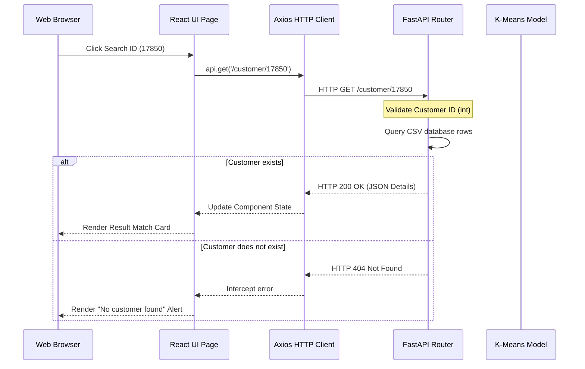

# REST API Documentation - Customer Segmentation System

This document provides complete technical specifications for the REST API of the Customer Segmentation System.

---

## 1. API Overview

The REST API for the Customer Segmentation System provides a programmatic interface to manage customer statistical data and execute machine learning inference. Built using the high-performance FastAPI framework, the API acts as the backend layer that serves data to the React client application.

### Core Capabilities
*   **JSON-Based Communications**: All request payloads and response bodies are formatted as JSON, conforming to REST conventions.
*   **Decoupled Frontend Integration**: Enables complete separation between client views and analytical operations.
*   **Real-Time Model Inference**: Performs real-time feature scaling and customer segment classification using a pre-trained K-Means clustering model.

---

## 2. API Base URL

The backend runs locally under the following baseline address during development:

```
http://127.0.0.1:8000
```

### Local Development Specifications
*   **Host Address**: `127.0.0.1` (localhost interface)
*   **Port Mapping**: `8000` (FastAPI standard port)
*   **CORS Configuration**: Explicitly permits incoming connections from standard Vite dev environments (`http://localhost:5173`, `http://localhost:5174`, `http://127.0.0.1:5173`, `http://127.0.0.1:5174`).

---

## 3. Authentication

The current development implementation **does not require authentication** to access any endpoints. 

### Future Security Roadmap
*   **JSON Web Token (JWT) Integration**: Future versions will implement secure JWT authentication. Clients will be required to authenticate via a `/login` endpoint and include a bearer token (`Authorization: Bearer <token>`) in request headers.

---

## 4. HTTP Status Codes

| Code | Status | Meaning / System Use Case |
| :--- | :--- | :--- |
| **200** | OK | Request executed successfully. Response contains the requested payload. |
| **201** | Created | Resources created successfully (reserved for future database insertions). |
| **400** | Bad Request | Request contains invalid parameters or syntax errors. |
| **404** | Not Found | Target database file is missing, or the requested Customer ID does not exist. |
| **422** | Unprocessable Entity | Payload failed validation check (e.g., negative integers in RFM input values). |
| **500** | Internal Error | Server calculation error, database read failure, or model inference crash. |
| **503** | Service Unavailable | The K-Means model binary failed to load on startup, disabling predictions. |

---

## 5. API Endpoints

### GET /
Retrieves basic details and health status of the Customer Segmentation API.

*   **HTTP Method**: `GET`
*   **Endpoint Path**: `/`
*   **Parameters**: None
*   **Success Response (200 OK)**:
    ```json
    {
      "message": "Customer Segmentation API",
      "status": "healthy"
    }
    ```
*   **Possible Status Codes**:
    *   `200 OK`

---

### GET /health
Returns execution health indicators for the backend server and loaded state of the model.

*   **HTTP Method**: `GET`
*   **Endpoint Path**: `/health`
*   **Parameters**: None
*   **Success Response (200 OK)**:
    ```json
    {
      "backend": "running",
      "model": "loaded",
      "version": "1.0.0"
    }
    ```
*   **Possible Status Codes**:
    *   `200 OK`

---

### GET /model-info
Retrieves metadata parameters describing the loaded K-Means classification model.

*   **HTTP Method**: `GET`
*   **Endpoint Path**: `/model-info`
*   **Parameters**: None
*   **Success Response (200 OK)**:
    ```json
    {
      "model_loaded": true,
      "algorithm": "KMeans",
      "clusters": 4
    }
    ```
*   **Unloaded Response (200 OK)**:
    ```json
    {
      "model_loaded": false,
      "error": "Model not loaded"
    }
    ```
*   **Possible Status Codes**:
    *   `200 OK`

---

### GET /dashboard
Computes and returns baseline analytics summary averages and cluster allocations of the customer base.

*   **HTTP Method**: `GET`
*   **Endpoint Path**: `/dashboard`
*   **Parameters**: None
*   **Success Response (200 OK)**:
    ```json
    {
      "total_customers": 4338,
      "total_segments": 4,
      "average_recency": 91.54,
      "average_frequency": 2.22,
      "average_monetary": 2048.69,
      "segment_distribution": {
        "Regular Customers": 780,
        "At Risk Customers": 869,
        "Premium Customers": 1648,
        "VIP Customers": 1041
      }
    }
    ```
*   **Field Explanations**:
    *   `total_customers`: Total unique customer profiles parsed.
    *   `total_segments`: The number of discrete clusters defined by the model ($k=4$).
    *   `average_recency`: Mean days elapsed since last purchase.
    *   `average_frequency`: Mean number of transactions completed.
    *   `average_monetary`: Mean lifetime expenditure per customer.
    *   `segment_distribution`: Customer counts allocated to each cluster.
*   **Possible Status Codes**:
    *   `200 OK`
    *   `404 Not Found` (database files missing)
    *   `500 Internal Server Error` (calculation error)

---

### POST /predict
Executes real-time machine learning predictions on customer RFM values.

*   **HTTP Method**: `POST`
*   **Endpoint Path**: `/predict`
*   **Request Body (JSON Schema)**:
    ```json
    {
      "recency": 15.0,
      "frequency": 25.0,
      "monetary": 8500.0
    }
    ```
*   **Success Response (200 OK)**:
    ```json
    {
      "cluster": 3,
      "segment": "Premium Customers"
    }
    ```
*   **Possible Status Codes**:
    *   `200 OK`
    *   `422 Unprocessable Entity` (validation error)
    *   `503 Service Unavailable` (model not loaded)
    *   `500 Internal Server Error` (inference error)

---

### GET /customer/{customer_id}
Locates customer records inside the reference database.

*   **HTTP Method**: `GET`
*   **Endpoint Path**: `/customer/{customer_id}`
*   **Path Parameters**:
    *   `customer_id` (integer, required): Unique identifier of target profile.
*   **Success Response (200 OK)**:
    ```json
    {
      "customer_id": 17850,
      "recency": 15.0,
      "frequency": 25.0,
      "monetary": 8500.0,
      "cluster": 3,
      "segment": "Premium Customers"
    }
    ```
*   **Error Response (404 Not Found)**:
    ```json
    {
      "detail": "Customer not found"
    }
    ```
*   **Possible Status Codes**:
    *   `200 OK`
    *   `404 Not Found`
    *   `422 Unprocessable Entity` (invalid path type)
    *   `500 Internal Server Error`

---

### GET /customer-details/{customer_id}
Calculates dynamic customer profiles, adding status indicators based on unscaled Recency metrics.

*   **HTTP Method**: `GET`
*   **Endpoint Path**: `/customer-details/{customer_id}`
*   **Path Parameters**:
    *   `customer_id` (integer, required): Unique identifier of target profile.
*   **Success Response (200 OK)**:
    ```json
    {
      "customer_id": 14911,
      "recency": 3.0,
      "frequency": 72.0,
      "monetary": 18000.0,
      "cluster": 1,
      "segment": "VIP Customers",
      "customer_status": "Active"
    }
    ```
*   **Error Response (404 Not Found)**:
    ```json
    {
      "detail": "Customer not found"
    }
    ```
*   **Possible Status Codes**:
    *   `200 OK`
    *   `404 Not Found`
    *   `422 Unprocessable Entity` (invalid path type)
    *   `500 Internal Server Error`

---

## 6. Request Validation

The backend uses Pydantic model validations to inspect incoming payloads before execution:
1.  **Required Fields Check**: Payload structures must supply required parameters (`recency`, `frequency`, and `monetary`).
2.  **Type Validation**: Checks for valid floats and integers.
3.  **Positive Ranges Check**: Parameters must be non-negative ($ge=0$).

If constraints are violated, the API blocks execution and returns a `422 Unprocessable Entity` status:
```json
{
  "detail": [
    {
      "loc": ["body", "recency"],
      "msg": "ensure this value is greater than or equal to 0",
      "type": "value_error.number.not_ge",
      "ctx": {
        "limit_value": 0.0
      }
    }
  ]
}
```

---

## 7. Error Responses

The backend standardizes error payloads under a `detail` key:

### 404 File or Customer Missing
```json
{
  "detail": "Customer not found"
}
```

### 422 Invalid Inputs
```json
{
  "detail": [
    {
      "loc": ["body", "monetary"],
      "msg": "value is not a valid float",
      "type": "type_error.float"
    }
  ]
}
```

### 503 Model Service Unavailable
```json
{
  "detail": "Prediction service unavailable: Customer segmentation model is not loaded."
}
```

---

## 8. API Workflow



---

## 9. Integration with Frontend

The React application uses a centralized Axios client configuration (`src/services/api.js`) to interact with the API:
*   **Base URL**: Set to `http://127.0.0.1:8000` to target the local FastAPI server.
*   **Timeout**: Requests terminate after `10000ms` if there is no response from the server.
*   **Request Interceptors**: Appends bearer tokens to outbound headers for future authorization features.
*   **Response Interceptors**: Catches exceptions globally, formatting responses to prevent application crashes.

---

## 10. Machine Learning Integration

Real-time segment predictions execute inside the `POST /predict` route:
1.  **Scaler Initialization**: A `StandardScaler` fits scaling variables from database baselines.
2.  **Inference**:
    *   Accepts raw inputs.
    *   Standardizes values: `scaled_features = scaler.transform(raw_features)`.
    *   Predicts the cluster ID: `kmeans.predict(scaled_features)`.
    *   Maps the cluster ID to a business segment name.

---

## 11. Performance Notes

*   **FastAPI Engine**: Powered by Uvicorn and Starlette, providing high throughput.
*   **One-Time Initialization**: Model files are loaded and scalers are fitted once on startup.
*   **Fast Predictions**: Real-time inference executes in milliseconds.
*   **Serialization**: Uses built-in standard libraries to serialize python datatypes to JSON structures.

---

## 12. Future API Improvements

1.  **JSON Web Token Security**: Implement JWT authentication.
2.  **Rate Limiting**: Throttling requests to prevent API abuse.
3.  **Pagination**: Add limit-offset query parameters (`?limit=50&offset=0`) to database lookups.
4.  **API Versioning**: Route via version paths (e.g. `/api/v1/predict`).
5.  **Caching**: Cache queries (using tools like Redis) to reduce backend disk accesses.

---

## 13. API Summary

The Customer Segmentation REST API is built on FastAPI and Pydantic. It provides endpoints for database querying, real-time predictions, and system health status. With pre-fit scaling and single-load model caching, the backend delivers high-throughput inference for frontend applications.
