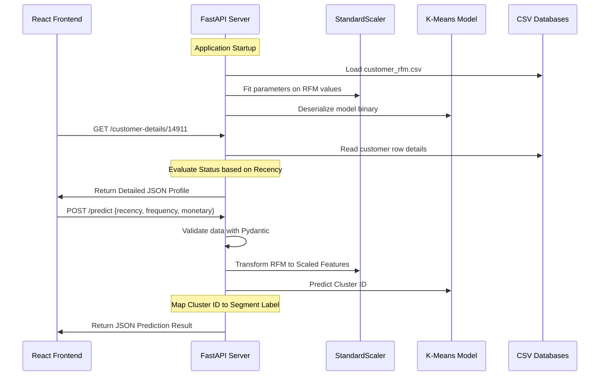

# Backend Documentation - Customer Segmentation System

This document provides a comprehensive analysis and technical manual for the backend implementation of the Customer Segmentation System.

---

## 1. Backend Overview

The backend acts as the core logical and analytical hub of the Customer Segmentation System. It is responsible for processing data requests, performing statistical summaries, querying the customer profile databases, and executing real-time machine learning predictions.

The backend leverages a FastAPI infrastructure to:
*   Expose high-performance REST APIs to the React frontend.
*   Enforce structured data constraints using Pydantic models.
*   Maintain a pre-trained K-Means clustering model in memory.
*   Execute feature scaling via a fitted `StandardScaler` to calculate predictions.

---

## 2. Backend Technology Stack

| Technology | Role / Purpose | Description |
| :--- | :--- | :--- |
| **Python** | Runtime Engine | The core programming language of the system backend. |
| **FastAPI** | REST API Layer | ASGI framework for building fast web interfaces. |
| **Uvicorn** | ASGI Web Server | The execution server hosting the FastAPI backend runtime. |
| **Pandas** | Data Processing | Data manipulation library used to read, query, and filter CSV tables. |
| **NumPy** | Numerical Utilities | Formats inputs into multi-dimensional arrays for inference. |
| **Scikit-Learn** | ML Pipeline | Library containing K-Means clustering and scaling utilities. |
| **Joblib** | Serialization | Deserializes the pre-trained K-Means model binary file. |
| **Pydantic** | Validation | Defines input schemas and enforces type validation. |
| **CORS Middleware** | Security Layer | Controls Cross-Origin Resource Sharing for safe frontend access. |

---

## 3. Backend Folder Structure

The core files of the backend are organized inside the `backend` and `datasets` modules:

```
customer-segmentation/
├── backend/
│   ├── app/                    # Primary Application Subdirectory
│   │   ├── __init__.py         # Package initialization
│   │   ├── main.py             # FastAPI entrypoint and routes
│   │   ├── model_loader.py     # Joblib deserializer utility
│   │   ├── schemas.py          # Input validation schemas
│   │   ├── dashboard.py        # Dashboard calculations engine
│   │   ├── customer_search.py  # Customer lookup controller
│   │   ├── customer_details.py # Profiles and status controller
│   │   ├── predict_segment.py  # Standalone CLI prediction script
│   │   ├── feature_scaling.py  # Data preprocessing scaling module
│   │   ├── data_preprocessing.py # Dataset cleaning module
│   │   ├── data_analysis.py    # General analytics summary module
│   │   ├── cluster_analysis.py # Model evaluation scripts
│   │   ├── eda.py              # Exploratory data analysis scripts
│   │   ├── elbow_method.py     # Clustering validation calculations
│   │   ├── segment_labeling.py # Business mapping scripts
│   │   ├── model_training.py   # Training script for K-Means
│   │   └── save_model.py       # Serializes the trained model to disk
│   └── scripts/                # Verification script triggers
└── datasets/                   # Database source directory
    ├── customer_rfm.csv        # Reference RFM features
    └── customer_segments_labeled.csv # Labeled customer segments
```

### Module Responsibilities
*   **main.py**: Initializes the FastAPI app, manages the startup event, fits the feature scaler, defines routes, handles CORS configurations, and triggers exceptions.
*   **model_loader.py**: Deserializes `models/customer_segmentation_model.joblib` and exposes it via a cached memory provider.
*   **schemas.py**: Validates incoming payload types, ensuring that numeric inputs are positive.
*   **dashboard.py**: Summarizes reference data, computing average recency, frequency, and monetary values alongside segment cluster counts.
*   **customer_search.py**: Performs key-value queries against local CSV datasets to retrieve customer data.
*   **customer_details.py**: Evaluates unscaled Recency values to assign dynamic relationship status categories (Active, Recent, Inactive, Dormant).
*   **predict_segment.py**: Provides verification of K-Means outputs via local CLI script executions.
*   **feature_scaling.py**: Standardizes datasets by applying the scaling equations.
*   **segment_labeling.py**: Maps K-Means cluster IDs to descriptive business segment names.
*   **data_preprocessing.py**: Parses invoice rows, removes anomalies (cancelled invoices, empty Customer IDs), and aggregates customer transactions.
*   **model_training.py**: Sets up K-Means parameters and fits clusters on scaled features.
*   **save_model.py**: Serializes the model object to disk.

---

## 4. FastAPI Application

### Initialization
FastAPI is instantiated inside `app/main.py` with metadata properties describing the system:
```python
app = FastAPI(
    title="Customer Segmentation API",
    description="Machine Learning Customer Segmentation Backend",
    version="1.0.0"
)
```

### Startup Event
On application start, the `@app.on_event("startup")` trigger runs initialization tasks:
1.  **Loading the Model**: Calls `load_kmeans_model()` from `app.model_loader`, caching the model object in memory.
2.  **Fitting the Scaler**: Reads the `datasets/customer_rfm.csv` dataset into a Pandas DataFrame and fits the global `StandardScaler` instance on the `Recency`, `Frequency`, and `Monetary` columns. This fits the mean and standard deviation parameters needed for subsequent predictions.

### CORS Configuration
FastAPI implements the standard `CORSMiddleware` class to authorize cross-origin requests from the React frontend running on local ports:
```python
app.add_middleware(
    CORSMiddleware,
    allow_origins=[
        "http://localhost:5173",
        "http://localhost:5174",
        "http://127.0.0.1:5173",
        "http://127.0.0.1:5174",
    ],
    allow_credentials=True,
    allow_methods=["*"],
    allow_headers=["*"],
)
```

---

## 5. Backend Workflow



---

## 6. API Endpoints

| Endpoint | Method | Input | Output | Success Status | Possible Errors |
| :--- | :--- | :--- | :--- | :---: | :--- |
| `/` | `GET` | None | Basic API health message | `200` | None |
| `/health` | `GET` | None | Backend run status and model state | `200` | None |
| `/model-info` | `GET` | None | Model metadata (algorithm name, cluster count) | `200` | `200` (if model is down, returns `model_loaded: false`) |
| `/dashboard` | `GET` | None | Summary averages, segment counts | `200` | `404` (missing file), `500` (calculation error) |
| `/predict` | `POST` | `CustomerInput` JSON | Predicted cluster ID, segment name | `200` | `422` (validation), `503` (model unavailable), `500` (inference error) |
| `/customer/{customer_id}` | `GET` | `customer_id` (Path integer) | Customer statistics and cluster label | `200` | `404` (not found), `422` (validation), `500` (server error) |
| `/customer-details/{customer_id}` | `GET` | `customer_id` (Path integer) | Customer profile and dynamic status badge | `200` | `404` (not found), `422` (validation), `500` (server error) |

---

## 7. Machine Learning Integration

Real-time segment prediction leverages a multi-step pipeline:

1.  **Loading the Model**: The K-Means model is loaded from disk:
    ```python
    kmeans_model = joblib.load("models/customer_segmentation_model.joblib")
    ```
2.  **Fitting the Scaler**: The `StandardScaler` calculates the scaling parameters from the baseline customer dataset:
    $$\mu = \text{mean}, \quad \sigma = \text{standard deviation}$$
3.  **Scaling Input Features**: Raw features $x = [R, F, M]$ are transformed using the fitted scaler parameters:
    $$z = \frac{x - \mu}{\sigma}$$
    ```python
    raw_features = np.array([[customer_in.recency, customer_in.frequency, customer_in.monetary]], dtype=float)
    scaled_features = scaler.transform(raw_features)
    ```
4.  **Clustering Prediction**: The scaled features $z$ are passed to the K-Means algorithm to compute Euclidean distances and return the closest cluster centroid ID:
    ```python
    predicted_cluster = int(kmeans_model.predict(scaled_features)[0])
    ```
5.  **Segment Mapping**: Maps cluster IDs to business segment labels:
    *   Cluster `0` $\rightarrow$ **Regular Customers**
    *   Cluster `1` $\rightarrow$ **At Risk Customers**
    *   Cluster `2` $\rightarrow$ **VIP Customers**
    *   Cluster `3` $\rightarrow$ **Premium Customers**

---

## 8. Request Validation

The application utilizes Pydantic validation models to enforce type constraints and range limits:

```python
class CustomerInput(BaseModel):
    recency: float = Field(..., ge=0, description="Recency (Days since last purchase). Must be non-negative.")
    frequency: float = Field(..., ge=0, description="Frequency (Number of unique invoices). Must be non-negative.")
    monetary: float = Field(..., ge=0, description="Monetary Value (Lifetime spend). Must be non-negative.")
```

If a client submits a payload violating these conditions (e.g. text input or negative values), FastAPI raises a `422 Unprocessable Entity` exception and returns the details of the validation error to the client.

---

## 9. Error Handling

The application uses standard HTTP status codes to signal request results:

*   **`404 Not Found`**: Returned if a database CSV file is missing or if the requested Customer ID does not exist in the reference records.
*   **`422 Unprocessable Entity`**: Returned if incoming payloads fail input validation rules (e.g. negative numbers, missing properties, or invalid data types).
*   **`500 Internal Server Error`**: Returned if database parse errors, scaler discrepancies, or mathematical calculation failures occur.
*   **`503 Service Unavailable`**: Returned if the application fails to load the model file on startup, disabling the `/predict` route.

---

## 10. JSON Response Formats

### `GET /health`
```json
{
  "backend": "running",
  "model": "loaded",
  "version": "1.0.0"
}
```

### `GET /dashboard`
```json
{
  "total_customers": 4338,
  "total_segments": 4,
  "average_recency": 91.54,
  "average_frequency": 2.22,
  "average_monetary": 2048.69,
  "segment_distribution": {
    "Regular Customers": 780,
    "At Risk Customers": 869,
    "Premium Customers": 1648,
    "VIP Customers": 1041
  }
}
```

### `POST /predict`
```json
{
  "cluster": 3,
  "segment": "Premium Customers"
}
```

### `GET /customer/17850`
```json
{
  "customer_id": 17850,
  "recency": 15.0,
  "frequency": 25.0,
  "monetary": 8500.0,
  "cluster": 3,
  "segment": "Premium Customers"
}
```

### `GET /customer-details/14911`
```json
{
  "customer_id": 14911,
  "recency": 3.0,
  "frequency": 72.0,
  "monetary": 18000.0,
  "cluster": 1,
  "segment": "VIP Customers",
  "customer_status": "Active"
}
```

---

## 11. Backend Security

### Current Security Setup
*   **CORS Safeguards**: Restricts client origin requests to specific local development ports.
*   **Validation Constraints**: Sanitizes parameter types via Pydantic model schemas.

### Security Limitations
*   **No Authentication Layer**: All endpoints are public and accessible without authentication tokens.
*   **No Rate Limiting**: The system does not implement rate limiting, leaving it vulnerable to denial-of-service attempts.

### Recommended Enhancements
*   **JWT Token Authorization**: Implement an OAuth2 token verification layer.
*   **Middleware Rate Limiting**: Implement rate-limiting middleware (such as `slowapi`) to throttle API endpoints.

---

## 12. Logging

The application outputs log statements during its lifecycle:
*   **Startup Logging**: Logs the model file path, dataset load status, and verification outcomes on start.
*   **Error Logging**: Tracks database file location issues, Pydantic type validation errors, and network request issues.
*   **Server Access Logs**: Uvicorn logs request statuses, processing times, HTTP methods, and client IP details.

---

## 13. Performance Considerations

*   **Fast Startup**: Caches model parameters and the reference `StandardScaler` object on startup.
*   **Single Model Load**: Deserializes the model once into memory, preventing file access overhead during inference.
*   **Low Latency**: Inference executes in milliseconds due to pre-fit scaling parameters.
*   **Low Memory Usage**: Leverages streaming database reads where possible to minimize memory overhead.

---

## 14. Future Backend Improvements

1.  **JSON Web Token Authentication**: Secure REST routes by requiring valid JWT tokens.
2.  **Relational Database System**: Migrate local CSV data files to a relational database system managed by SQL databases.
3.  **CSV Upload Processing**: Enable background processing for bulk user CSV uploads.
4.  **Automatic Pipeline Retraining**: Set up periodic retraining jobs to refresh cluster alignments.
5.  **Docker Containerization**: Containerize backend services for simplified, scalable deployments.
6.  **Caching Layers**: Cache customer query profiles using in-memory databases (such as Redis) to reduce disk I/O.

---

## 15. Backend Summary

The backend implementation maps REST endpoints to a machine learning pipeline. By loading models into memory on startup and using fitted scaling matrices, the API serves real-time predictions and database queries with minimal latency, supporting future additions like cloud deployments, databases, and secure authentication layers.
