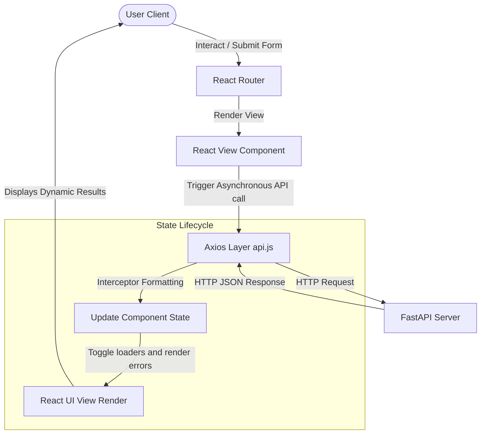

# Frontend Documentation - Customer Segmentation System

This document provides a comprehensive technical overview and operational manual for the frontend implementation of the Customer Segmentation System.

---

## 1. Frontend Overview

The frontend layer of the Customer Segmentation System serves as an interactive graphical user interface (GUI) designed for business administrators and data analysts. It translates machine learning outputs into actionable retail analytics.

The frontend architecture is built on React 18, leveraging the following core principles:
*   **React Component Architecture**: Employs modular components, separating presentation layouts (CSS) from logical controllers (JS).
*   **API Service Communication**: Coordinates asynchronous operations with the FastAPI backend through a custom Axios wrapper.
*   **User Experience (UX) Goals**: Implements responsive dashboard layouts, smooth state transitions, visual data loading spinners, and an interactive dark/light theme toggle.

---

## 2. Frontend Technology Stack

| Technology | Layer | Role / Purpose | Selection Rationale |
| :--- | :--- | :--- | :--- |
| **React** | Component Core | UI Views rendering and state management. | Declarative components allow for clean component isolation and modular dashboard views. |
| **Vite** | Bundling Engine | Frontend local dev server and compiler bundler. | Sub-second compilation and hot module replacement (HMR) during developer runs. |
| **React Router** | Page Router | Client-side page navigation router. | Handles fast client-side transitions without full browser page reloads. |
| **Axios** | Networking | HTTP client client-backend communications. | Automatically checks network timeouts, formats JSON, and manages request interceptors. |
| **CSS3** | Style Engine | Modular layout and dark mode variable theming. | Plain CSS custom properties eliminate runtime compilation overhead from libraries. |
| **JavaScript** | Logical Layer | Asynchronous fetching, mapping, and validations. | Modern ES6 syntax supports clean, maintainable logic across the client codebase. |
| **HTML5** | Layout Semantics | Web structure layouts. | Provides accessible and semantic layout structures. |

---

## 3. Frontend Folder Structure

The frontend source files are structured inside the `frontend/src` directory:

```
frontend/
├── dist/                       # Compiled production static web files
├── src/                        # Source Code
│   ├── assets/                 # Vector logo files and static resources
│   ├── components/             # Reusable UI presentation components
│   │   ├── charts/             # Pure React + CSS bar and segment charts
│   │   │   ├── ChartsSection.jsx
│   │   │   └── ChartsSection.css
│   │   ├── customer/           # Tabular customer grids and lists
│   │   │   ├── CustomerTable.jsx
│   │   │   └── CustomerTable.css
│   │   └── layout/             # Global application wrapper shell
│   │       ├── Sidebar.jsx     # Side menu links navigator
│   │       ├── Sidebar.css
│   │       ├── Header.jsx      # Top toolbar, breadcrumbs, theme toggle
│   │       └── Header.css
│   ├── context/                # Context provider state models
│   │   └── ThemeContext.jsx    # Holds theme context values
│   ├── pages/                  # Route views
│   │   ├── CustomerDetails.jsx # Detailed customer card lookups
│   │   ├── CustomerDetails.css
│   │   ├── CustomerSearch.jsx  # Customer ID search query cards
│   │   ├── CustomerSearch.css
│   │   ├── Dashboard.jsx       # Main system widgets
│   │   ├── Dashboard.css
│   │   ├── Prediction.jsx      # Real-time ML classifier form
│   │   └── Prediction.css
│   ├── services/               # API service layer
│   │   └── api.js              # Centralized Axios instance configuration
│   ├── App.jsx                 # Route configurations and entry layout wrappers
│   ├── index.css               # Theme styling and global transitions setup
│   └── main.jsx                # DOM attachment entrypoint
```

---

## 4. Application Architecture

*   **main.jsx**: The entry point that mounts the application. It wraps the core `<App />` component in `<React.StrictMode>` for compile verification.
*   **App.jsx**: Manages routes and global context wrapping. It integrates the `<ThemeProvider>` context boundary with the React Router routing boundaries, serving the main `<Layout>` component containing the sidebar and page views.
*   **Theme Provider**: The React Context Provider that hosts the global theme state.
*   **Axios Service**: The configured HTTP requester client that exposes standard verbs to pages and tables.
*   **Global Layout**: Implemented inside `src/components/layout/Layout.jsx`, rendering the Sidebar on the left and the Header + Page Views inside a main container on the right.

---

## 5. React Router Architecture

The client application implements single-page routing managed by React Router DOM. All major navigation steps occur on the client side without triggering page reloads:

| Route Path | Associated Page | View Objective |
| :--- | :--- | :--- |
| `/` | `Dashboard` | Summarizes ML customer base cluster details and statistics. |
| `/search` | `CustomerSearch` | Locates specific Customer ID records and displays metrics. |
| `/prediction` | `Prediction` | Classifies new inputs using the pre-trained model. |
| `/customer-details` | `CustomerDetails` | Inspects detailed customer parameters, status, and recommendations. |

### Navigation Flow
1.  Users click on NavLinks inside the `Sidebar` component.
2.  React Router intercepts the link and updates the history stack.
3.  The main layout view switches components automatically, keeping active sidebar states highlighted.
4.  The `Header` component intercepts the route changes to dynamically update its page title and breadcrumb trail.

---

## 6. Layout Components

*   **Sidebar**: Renders the application logo and nav links (Dashboard, Customer Search, Prediction, Customer Details) using React Router's `<NavLink>`. It applies an `.active` class to style the currently selected route.
*   **Header**: Placed at the top right of the dashboard. It renders:
    *   **Breadcrumbs**: Displays the path (e.g. `Dashboard`, `Prediction`) based on the active location.
    *   **Theme Toggle Button**: A round button rendering a Moon icon (when light theme is active) or Sun icon (when dark theme is active) to switch themes.
    *   **Search Bar Placeholder**: Non-functional input box for visual completeness.
    *   **User Avatar & Profile Info**: Displays default user profile states.
*   **Theme Toggle**: Implemented as a click handler that calls `toggleTheme()` in `ThemeContext`, applying the selected theme code to the root HTML document.
*   **Responsive Layout**: Configured with media query breakpoints. At tablet width (768px) and mobile width (480px), grid columns collapse, forms wrap vertically, and paddings contract.

---

## 7. Pages Documentation

### Dashboard
*   **Purpose**: Displays aggregated statistics of the customer database.
*   **UI Components**: Summary cards, ChartsSection, CustomerTable.
*   **Backend API Used**: `GET /dashboard`
*   **Displayed Data**: Total analyzed customers, total clusters ($k=4$), average Recency, average Monetary Value, and cluster distribution percentages.
*   **User Flow**: On load, the dashboard queries the API, renders a loading spinner, and then displays the summary cards and charts once the request completes.

### Customer Search
*   **Purpose**: Allows users to search for specific customer records by their unique Customer ID.
*   **UI Components**: Form input wrapper, results summary grid, status indicators.
*   **Backend API Used**: `GET /customer/{customer_id}`
*   **Displayed Data**: Customer ID, assigned K-Means segment, unscaled Recency, Frequency, and Monetary spend.
*   **User Flow**: The user enters an ID, validations check if the entry is a positive integer, and the Search button triggers the API. The profile card slides in on success.

### Prediction
*   **Purpose**: Accesses the model inference pipeline to classify arbitrary customer metrics.
*   **UI Components**: Numeric form inputs (Recency, Frequency, Monetary Value), results card displaying assigned segment cluster name, and strategic recommendations.
*   **Backend API Used**: `POST /predict`
*   **Displayed Data**: Predicted customer segment name, Cluster ID number, and target recommendations.
*   **User Flow**: The user inputs raw RFM features and clicks Predict. The button disables, the API executes, and the results card displays the predicted segment.

### Customer Details
*   **Purpose**: Displays detailed customer profile data, dynamic relationship statuses, and recommended marketing actions.
*   **UI Components**: Customer search form selector, profile banner, demographics grid, behavioral checklist, and action cards.
*   **Backend API Used**: `GET /customer-details/{customer_id}`
*   **Displayed Data**: Customer ID, segment name, unscaled RFM values, calculated customer status (Active, Recent, Inactive, Dormant), behavioral flags, and target marketing recommendations.
*   **User Flow**: Automatically loads customer `#14911` on mount. Users can search other IDs using the selector form to update the profile details.

---

## 8. Components Documentation

*   **Summary Cards**: Renders key metric values inside glassmorphism panels.
*   **ChartsSection**: Displays segment distributions in horizontal bars, representing customer percentages across K-Means clusters.
*   **CustomerTable**: Shows customer rows in a scrollable, sticky-header table.
*   **Prediction Form**: Controls input values and handles submission actions.
*   **Search Form**: Standardizes text searches and inputs for Customer IDs.
*   **Customer Details Card**: Renders demographic tables and unscaled metrics.
*   **Status Badge**: Renders color-coded status tags (Active, Recent, Inactive, Dormant) mapping success, warning, or danger color schemes.
*   **Recommendation Card**: Translates segment names into lists of target marketing actions (winback campaigns, VIP loyalty rewards, regular discount updates).
*   **Loading Components**: Renders a spinning loader wheel for active API requests.
*   **Error Components**: Displays connection failure alerts and retry buttons.

---

## 9. API Communication

Centralized under `src/services/api.js`, the Axios client wraps HTTP requests:

```javascript
const api = axios.create({
  baseURL: import.meta.env.VITE_API_URL || 'http://127.0.0.1:8000',
  timeout: 10000,
  headers: {
    'Content-Type': 'application/json',
  },
});
```

### Interceptors
*   **Request Interceptor**: Automatically inserts an `Authorization: Bearer <token>` header if a token is present in local storage.
*   **Response Interceptor**: Intercepts error codes outside the `2xx` range. It standardizes server payloads into clear objects (`{ message, status, data }`) for the UI pages, preventing raw backend errors from crashing components.

---

## 10. State Management

The frontend uses standard React State APIs:
1.  **`useState`**: Stores query responses, loading states, error strings, and form values.
2.  **`useEffect`**: Triggers data fetching on component mount or parameter changes.
3.  **Context API (`ThemeContext`)**: Manages the application theme state across the layout.

---

## 11. Theme System

The application supports Light and Dark modes:
*   **State Hook**: `ThemeContext` initializes the theme state. It checks `localStorage` for a saved preference, falling back to the system preference if none is found.
*   **HTML Attribute Binding**: Switching themes toggles the `data-theme` attribute on the root document element:
    ```javascript
    document.documentElement.setAttribute('data-theme', theme);
    ```
*   **CSS Variables**: All styled layouts reference variables defined in `index.css`:
    *   `--bg`: Background colors
    *   `--card-bg`: Card container colors
    *   `--text`: Typography colors
    *   `--border`: Card borders
*   **Smooth Theme Transitions**: Applies a CSS transition property to elements:
    ```css
    transition: background-color 0.25s ease, color 0.25s ease, border-color 0.25s ease;
    ```

---

## 12. Responsive Design

The interface uses fluid grid systems and media queries:
*   **Desktop (1024px+)**: Standard sidebar and multi-column grid layouts.
*   **Tablet (768px - 1023px)**: Grids contract to single columns where necessary, forms stack vertically, and padding values adjust.
*   **Mobile (max 767px)**: Tables overflow horizontally with scroll indicators, buttons span full width, and sidebar controls adjust to screen limits.

---

## 13. Error Handling

*   **Loading Screen**: Displays a loading spinner while API requests are pending.
*   **Connection Error Cards**: Displays a warning card with a Retry button if the API request fails (e.g. backend server offline).
*   **404 Handling**: Catches 404 errors (customer profile not found) and displays a clean status message instead of logging console failures.
*   **Validation Errors**: Catches validation errors (422 status) from the FastAPI backend (e.g. negative inputs) and displays which fields failed validation.

---

## 14. UI Design Decisions

*   **React + Vite**: Provides high performance and fast build speeds.
*   **Axios**: Enables interceptor management, timeout configurations, and clean error handling.
*   **React Router**: Handles fast routing in single-page applications.
*   **Glassmorphism**: Combines translucent card backgrounds (`rgba`), blur filters (`backdrop-filter`), and thin borders (`--border`) to create a modern SaaS dashboard aesthetic.
*   **Theme Toggle**: Implements an interactive theme system that matches OS settings on load.

---

## 15. Frontend Workflow



---

## 16. Performance Optimizations

*   **Component Reusability**: Visual layouts (cards, forms, tables) are created once as reusable components.
*   **Single Axios client**: Reuses a single configured Axios instance across all pages.
*   **CSS Animation performance**: Transitions run on GPU-accelerated CSS properties (`background-color`, `color`, `border-color`).
*   **Strict State Scope**: Limits state scopes to prevent unnecessary component re-renders.

---

## 17. Future Improvements

1.  **Authentication**: Secure endpoints with user authentication (OAuth2 / JWT).
2.  **Expanded Data Visualizations**: Use visualization libraries (such as Recharts) to render interactive graphs.
3.  **Real-Time Data Streams**: Integrate WebSockets to stream incoming transactional records in real time.
4.  **Automatic Alerts**: Configure notifications for customer status changes.
5.  **Internationalization**: Add translations for multi-language support.
6.  **Progressive Web App (PWA)**: Implement service workers to enable offline access.

---

## 18. Frontend Summary

The frontend implementation converts backend API responses into interactive analytics. By leveraging React's modular structure, a central Axios API layer, and an interactive theme system, the application delivers a premium, responsive dashboard user experience.
