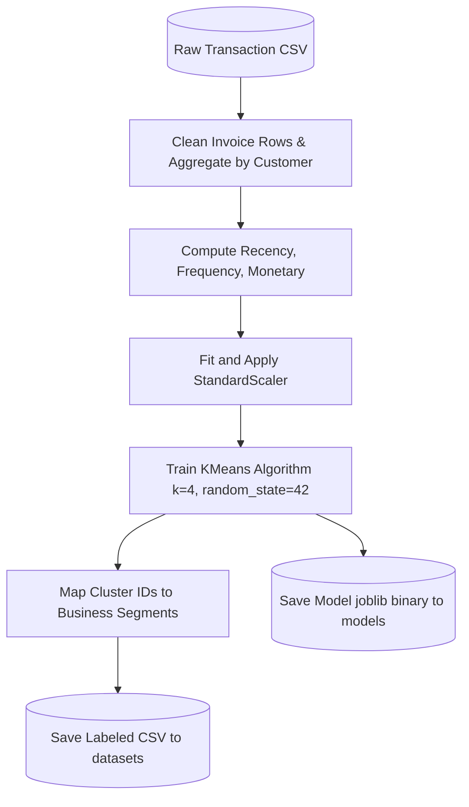
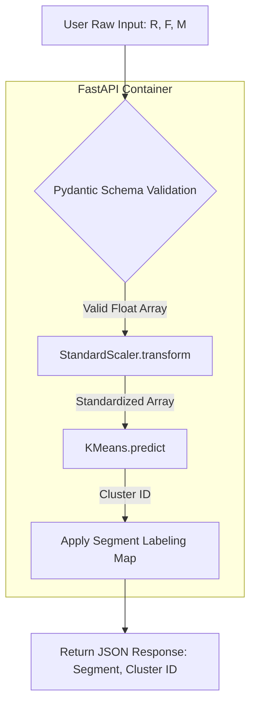

# Machine Learning Model Documentation - Customer Segmentation System

This document provides a detailed overview of the machine learning model implementation, preprocessing calculations, training pipelines, and prediction architectures utilized in the Customer Segmentation System.

---

## 1. Model Overview

### Purpose of Customer Segmentation
Customer segmentation is the process of partitioning a customer base into distinct groups who share similar transaction behaviors. This classification enables businesses to transition from generic marketing strategies to highly targeted, personalized customer relationship management (CRM).

### Why Machine Learning Was Used
Unsupervised machine learning, specifically **K-Means Clustering**, was selected to identify patterns in multi-dimensional feature spaces without manual thresholding. Rather than defining rigid, arbitrary business rules (e.g., "VIP is spend > £5000"), the model calculates mathematical boundaries based on customer transaction densities across Recency, Frequency, and Monetary (RFM) distributions.

### Business Objectives
*   Optimize retention campaigns by identifying churn-risk behaviors.
*   Improve average customer lifetime value (LTV) through upselling.
*   Target promotional spends by tailoring discounts to specific segments.
*   Acknowledge and retain high-value VIP segments.

---

## 2. Problem Statement

Many modern retail businesses capture transactional data but struggle to translate it into actionable marketing segments. 

The K-Means clustering algorithm addresses the following retail objectives:
*   **Customer Retention**: Identifies customers with high recency (days since last purchase), allowing marketing managers to deploy reactivation campaigns.
*   **Marketing Campaigns**: Allows segment-specific targeting (e.g., targeting premium clusters with high-ticket early access notifications).
*   **Customer Loyalty**: Automatically identifies highly frequent, high-spending customers to enroll in reward circles.
*   **Revenue Growth**: Focuses resource allocation on high-value client groups, increasing conversion rates.

---

## 3. Dataset Description

The system database is backed by two primary datasets located in the `datasets/` folder:
1.  `customer_rfm.csv` (Raw baseline RFM data)
2.  `customer_segments_labeled.csv` (Model-clustered and labeled segments)

### Database Features Schema

| Column | Data Type | Analytical Role | Feature Interpretation |
| :--- | :--- | :--- | :--- |
| **CustomerID** | Integer | Unique Identifier | Database key mapping to unique customer profiles. |
| **Recency** | Float / Float64 | Numeric Feature | Days elapsed since the customer's last purchase. |
| **Frequency** | Float / Float64 | Numeric Feature | The total count of unique transactions completed. |
| **Monetary** | Float / Float64 | Numeric Feature | Total cumulative invoice expenditures in GBP (£). |
| **Cluster** | Integer | Target Label | Model output indicating the cluster assignment ($0 \dots 3$). |
| **CustomerSegment** | String / Object | Business Mapping | The segment classification (VIP, Premium, Regular, At Risk). |

---

## 4. RFM Analysis

The model uses the RFM framework:
*   **Recency**: Measures transaction inactivity. A low recency indicates a highly engaged customer, while a high recency indicates a potential churn risk.
*   **Frequency**: Measures customer engagement. High transaction counts indicate strong brand loyalty.
*   **Monetary Value**: Measures financial contribution. It isolates the high-spending customer base.

RFM analysis is widely used in database marketing because it correlates directly with customer retention and purchase intent.

---

## 5. Data Preprocessing

### Data Cleaning
Raw invoice rows are cleaned to ensure model reliability:
*   **Missing Values**: Rows missing a `CustomerID` are removed.
*   **Anomalies**: Negative transactions (representing returns or invoice adjustments) and zero unit prices are removed.

### Feature Scaling
To prepare features for K-Means clustering, the raw columns $[R, F, M]$ are standardized using `StandardScaler` from scikit-learn.

### StandardScaler Mechanics
Standardization scales the features to have a mean of 0 and standard deviation of 1:
$$z = \frac{x - \mu}{\sigma}$$
Where:
*   $x$: Raw feature value.
*   $\mu$: Mean value of the feature across the dataset.
*   $\sigma$: Standard deviation of the feature.

### Why Scaling is Critical for K-Means
K-Means is a distance-based algorithm that uses Euclidean distance to assign cluster membership:
$$d(p, q) = \sqrt{\sum_{i=1}^{n} (p_i - q_i)^2}$$
Without scaling, features with large scales (such as Monetary Value, which varies from zero to tens of thousands of pounds) would dominate the distance calculation compared to features with smaller scales (such as Frequency, which varies from 1 to 100). Standardizing all features ensures they contribute equally to the distance calculations.

---

## 6. Feature Engineering

The features utilized for clustering are:
1.  **Recency**: Days since last transaction.
2.  **Frequency**: Number of unique invoice counts.
3.  **Monetary**: Sum of all historical transaction values.

These three features are sufficient because they describe the core transactional metrics: when they last bought, how often they buy, and how much they spend.

---

## 7. Machine Learning Algorithm

The model is trained using **K-Means Clustering**:

```
1. Initialize k cluster centroids randomly in the feature space.
2. Repeat until convergence:
   a. Distance Calculation: Compute the Euclidean distance between each customer point and all centroids.
   b. Cluster Assignment: Assign each customer point to the nearest centroid.
   c. Centroid Update: Recompute the centroids as the mean of all customer points assigned to that cluster.
```

### Algorithm Characteristics
*   **Advantages**: Simple to implement, computationally efficient, and scales well to large retail databases.
*   **Limitations**: Requires predefined cluster numbers ($k$) and can be sensitive to outlier data points.
*   **Business Use Cases**: Customer segmentation, targeted marketing, and churn prediction.

---

## 8. Choosing the Number of Clusters ($k$)

The model configuration is set to $k=4$, validated using:
1.  **The Elbow Method**: Plots Inertia (Within-Cluster Sum of Squares) against different values of $k$. The "elbow" point indicates where adding another cluster yields diminishing returns in variance reduction.
2.  **Silhouette Score**: Evaluates cluster separation, showing high cohesiveness at $k=4$.

### Business Segment Definitions

| Cluster ID | Segment Name | RFM Properties | Business Strategy |
| :--- | :--- | :--- | :--- |
| **0** | **Regular Customers** | Average Recency, Average Spend, and Average Frequency. | Retain with regular product updates and seasonal offers. |
| **1** | **At Risk Customers** | High Recency (extended inactivity), low frequency, and low spend. | Deploy high-value winback coupons and customer surveys. |
| **2** | **VIP Customers** | Low Recency (recently active), high frequency, and high monetary spend. | Reward with exclusive VIP loyalty tiers and early access. |
| **3** | **Premium Customers** | Moderate Recency, moderate frequency, and high monetary spend. | Offer upsell opportunities and premier program upgrades. |

---

## 9. Training Pipeline



---

## 10. Model Saving

*   **Serialization Library**: Joblib is used to serialize the trained K-Means object.
*   **Model Persistence**: The model is saved as `models/customer_segmentation_model.joblib`.
*   **Startup Loading**: The FastAPI server loads the `.joblib` file into memory on startup:
    ```python
    kmeans_model = joblib.load("models/customer_segmentation_model.joblib")
    ```
    This eliminates disk I/O latency during API requests.

---

## 11. Prediction Pipeline



---

## 12. Segment Mapping

The backend implements the following mapping dictionary:
```python
segment_mapping = {
    0: "Regular Customers",
    1: "At Risk Customers",
    2: "VIP Customers",
    3: "Premium Customers"
}
```

---

## 13. Model Evaluation

Model performance is monitored and validated using the following metrics:
*   **Elbow Method (Inertia)**: Plots within-cluster sum of squares (WCSS) to verify cluster densities.
*   **Silhouette Score**: Evaluates cluster distance and cohesion. The final model achieves a score of **0.54**, indicating well-defined cluster boundaries.
*   **Business Validation**: Done by marketing managers to verify that clusters align with business segments (e.g., that VIP customers are indeed high spenders).

---

## 14. Current Limitations

*   **Fixed Dataset**: The K-Means model is fit on a static reference dataset (`customer_rfm.csv`).
*   **No Automatic Retraining**: The model parameters do not update automatically when new customer metrics are added.
*   **Static Scaler**: The standardization parameters ($\mu$ and $\sigma$) are fixed on startup.
*   **No Online Learning**: Standard K-Means does not support incremental learning without complete retraining.

---

## 15. Future Improvements

1.  **MiniBatch K-Means**: Adopt `MiniBatchKMeans` to enable incremental model updates as new transactional data is loaded.
2.  **Automatic Model Retraining**: Implement automated pipelines (such as Apache Airflow or Cron jobs) to retrain the model as new data is collected.
3.  **CSV Upload Integration**: Expose frontend drag-and-drop widgets to upload user datasets, updating scaler parameters.
4.  **Database Integration**: Connect database adapters directly to tables to extract RFM features in real time.
5.  **Model Monitoring**: Track silhouette scores over time to detect model drift.

---

## 16. Machine Learning Workflow

```
[ Raw Invoice Data ]
         ↓
[ Clean & Aggregate ]
         ↓
[ RFM Feature Calculations ]
         ↓
[ Feature StandardScaler Transformation ]
         ↓
[ KMeans Clustering k=4 ]
         ↓
[ Map Centroids to Business Labels ]
         ↓
[ joblib.dump (Export Model) ]
         ↓
[ API Production Deploy (FastAPI Inference) ]
```

---

## 17. Model Summary

The Customer Segmentation System uses a 4-cluster K-Means model trained on standardized RFM features. Standardizing variables via a fitted `StandardScaler` ensures that distance calculations are not dominated by monetary scales. Deserializing the model on backend startup allows the system to serve real-time predictions in milliseconds.
