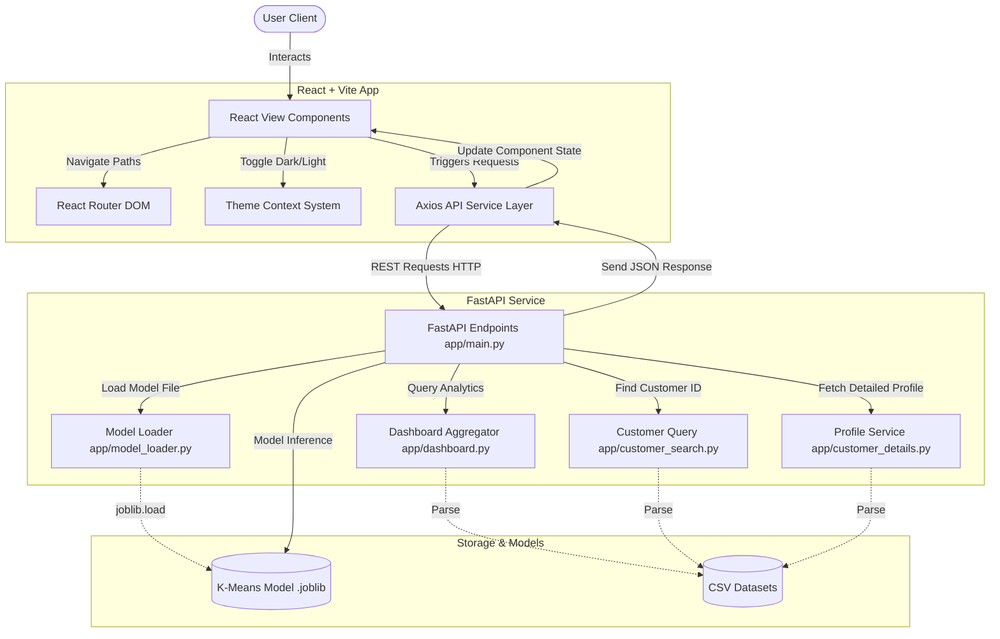

# Project Architecture - Customer Segmentation System

This document provides a detailed architectural overview of the Customer Segmentation System. It outlines the system workflow, codebase folder structure, machine learning backend pipeline, frontend layout patterns, API communications schema, and primary engineering design decisions.

---

## 1. Project Overview

The Customer Segmentation System is a production-ready, machine learning-driven analytical application designed to categorize a customer base using Recency, Frequency, and Monetary (RFM) metrics. 

By applying a K-Means clustering algorithm, the system automatically groups customers with similar purchasing habits into discrete segments:
*   **VIP Customers**: High purchase frequency and high lifetime expenditure.
*   **Premium Customers**: Consistent buyer patterns with high average transaction values.
*   **Regular Customers**: Average purchasing frequency and standard transaction values.
*   **At Risk Customers**: Prolonged transaction inactivity, indicating potential churn risk.

The system features a dual-layer architecture: a FastAPI backend hosting a trained machine learning model, and a responsive React frontend styled using raw CSS custom properties with support for light and dark themes.

---

## 2. Overall Architecture

The application communicates over a client-server model:
1.  **React Frontend**: Interacts with the user, collects input variables, displays dynamic stats, and triggers data queries.
2.  **FastAPI Backend**: Serves as the processing and inference engine. It loads the K-Means model on startup and exposes REST endpoints for dashboard analytics, customer retrieval, and segment predictions.

### Operational Lifecycle
1.  **Startup**: The FastAPI application starts and loads the pre-trained K-Means clustering model (`customer_segmentation_model.joblib`) into memory.
2.  **Dashboard Load**: The frontend triggers a `GET /dashboard` request. The backend calculates total counts, segment allocations, and average metrics from reference CSV databases (`customer_rfm.csv` and `customer_segments_labeled.csv`), returning these to build summary metrics and charts.
3.  **Customer Search & Profile Details**: The user inputs a Customer ID. The frontend sends a `GET /customer/{customer_id}` or `GET /customer-details/{customer_id}` request. The backend queries database rows, evaluates the customer status (Active, Recent, Inactive, Dormant) based on unscaled Recency, and returns the profile details.
4.  **Clustering Prediction**: The user enters arbitrary RFM features into the prediction page. The frontend sends a `POST /predict` request. The backend standardizes these values using a reference `StandardScaler` fitted on the raw dataset and passes them to the K-Means model to predict the segment cluster.

---

## 3. High-Level System Architecture Diagram



---

## 4. Folder Structure

The root workspace is organized into separate modules supporting data science, backend api, testing, and frontend components:

```
customer-segmentation/
├── backend/                # FastAPI application source, modules, and scripts
│   ├── app/                # Main API service, schemas, and router controllers
│   └── scripts/            # Script executions for local testing
├── frontend/               # React + Vite frontend source code
│   ├── src/                # Component structure and application pages
│   └── dist/               # Built static web files for production deployment
├── datasets/               # CSV database sources (raw RFM, scaled, and labeled)
├── models/                 # Serialized K-Means models and scaler joblib binaries
├── notebooks/              # Jupyter notebooks used for EDA and model training
├── screenshots/            # Asset capture files for documentation visual references
├── tests/                  # Backend pytest script directories
└── docs/                   # System architectural and markdown documentation files
```

### Folder Responsibilities
*   **backend**: Holds the python backend service. The subdirectory `backend/app/` holds backend endpoints, data loaders, schemas, and controller modules.
*   **frontend**: Holds the frontend application. It contains reusable components (layouts, charts, customer tables) and routing setups.
*   **datasets**: Contains the dataset files `customer_rfm.csv` and `customer_segments_labeled.csv` that serve as the local database.
*   **docs**: Stores technical documentation guides.
*   **models**: Holds the serialized K-Means model `customer_segmentation_model.joblib`.
*   **notebooks**: Contains exploration files used for building the clustering algorithm.
*   **screenshots**: Hosts visual images documenting page styles.
*   **tests**: Contains scripts used to run unit tests on the model pipelines.

---

## 5. Backend Architecture

The backend application contains separated modules responsible for distinct endpoints:

*   **main.py**: The FastAPI application entrypoint. Configures CORS middleware permissions, handles startup events, defines routing pathways (`/`, `/health`, `/model-info`, `/predict`, `/dashboard`, `/customer/{id}`, `/customer-details/{id}`), and implements global server exception handling.
*   **model_loader.py**: Manages global loading states. Reads `customer_segmentation_model.joblib` using `joblib.load` and caches it in memory.
*   **dashboard.py**: Queries reference tables, aggregates counts, computes unscaled mean values (average Recency, Frequency, Monetary values), and builds segment allocation datasets.
*   **customer_search.py**: Locates specific Customer ID metrics, returning unscaled RFM properties alongside cluster labels.
*   **customer_details.py**: Extends customer queries by evaluating customer status (Active, Recent, Inactive, Dormant) based on unscaled Recency intervals.
*   **predict_segment.py**: Contains inference procedures. It fits a `StandardScaler` using database reference values and scales input values prior to model prediction.
*   **schemas.py**: Holds Pydantic models (like `CustomerInput`) to enforce input data validation during request parsing.

---

## 6. Frontend Architecture

The frontend is constructed using React 18 and Vite:

*   **React + Vite**: Enables fast Hot Module Replacement (HMR) and fast build processes.
*   **Axios API Layer**: Centralized under `src/services/api.js`. Exports a single Axios instance containing a timeout configuration of `10000ms`, base URL mapping to `http://127.0.0.1:8000`, standard `Content-Type: application/json` headers, and interceptors for authorization token insertion and global error parsing.
*   **React Router**: Manages application routing (`/` to Dashboard, `/search` to Customer Lookup, `/prediction` to Model Inference, and `/customer-details` to Profiles).
*   **Components & Pages**:
    *   `Layout`: Hosts the global template structure.
    *   `Sidebar`: The primary sidebar navigation with active path highlights.
    *   `Header`: The top header containing breadcrumbs, notification indicators, and the Dark/Light theme toggle button.
    *   `Dashboard`: Pulls live API stats and renders metrics and charts.
    *   `CustomerTable`: Displays customer profiles in a responsive tabular layout.
    *   `ChartsSection`: Renders Pure React + CSS bar charts representing segment distributions.
*   **Theme Context System**: Installs a `ThemeContext` providing state variables (`theme`, `toggleTheme`) and binds them to the document root element using the `data-theme` attribute, which persists selections in `localStorage`.
*   **Shared CSS**: Driven by Custom CSS variables mapped in `index.css` to enable smooth theme transitions.

---

## 7. Machine Learning Architecture

The customer classification pipeline relies on K-Means clustering:

1.  **Reference Dataset (`customer_rfm.csv`)**: Holds the customer purchase metrics (Recency, Frequency, Monetary).
2.  **StandardScaler**: Standardizes features by centering and scaling (subtracting the mean and dividing by the standard deviation). This is critical since K-Means calculations rely on Euclidean distances, which would otherwise be distorted by monetary scale differences compared to order counts.
3.  **K-Means Model**: A 4-cluster model trained on the standardized RFM features using the Elbow Method to validate clustering parameters.
4.  **Model Loading**: The model is saved as a `.joblib` binary file and loaded on startup for fast inference times.
5.  **Prediction Pipeline**:
    *   Inputs: Recency (days), Frequency (orders), Monetary (spend).
    *   The values are structured into a 2D array: `[[R, F, M]]`.
    *   The `StandardScaler` is fitted on reference RFM data to establish scale constraints.
    *   Features are transformed: `scaled_features = scaler.transform(raw_features)`.
    *   The K-Means model predicts the cluster ID: `kmeans.predict(scaled_features)`.
    *   The cluster ID is mapped to a customer segment name.

---

## 8. API Communication Flow

The backend exposes the following REST APIs:

### `GET /dashboard`
Retrieves aggregated dataset statistics.
*   **Request**: `GET /dashboard`
*   **Response Payload**:
    ```json
    {
      "total_customers": 4338,
      "total_segments": 4,
      "average_recency": 91.54,
      "average_frequency": 2.22,
      "average_monetary": 2048.69,
      "segment_distribution": {
        "Regular Customers": 780,
        "At Risk Customers": 869,
        "Premium Customers": 1648,
        "VIP Customers": 1041
      }
    }
    ```

### `POST /predict`
Performs segment classification on RFM input features.
*   **Request**: `POST /predict`
*   **Request Body**:
    ```json
    {
      "recency": 15.0,
      "frequency": 25.0,
      "monetary": 8500.0
    }
    ```
*   **Response Payload**:
    ```json
    {
      "cluster": 3,
      "segment": "Premium Customers"
    }
    ```

### `GET /customer/{customer_id}`
Retrieves customer record indicators.
*   **Request**: `GET /customer/17850`
*   **Response Payload**:
    ```json
    {
      "customer_id": 17850,
      "recency": 15.0,
      "frequency": 25.0,
      "monetary": 8500.0,
      "cluster": 3,
      "segment": "Premium Customers"
    }
    ```

### `GET /customer-details/{customer_id}`
Retrieves extended customer profiles.
*   **Request**: `GET /customer-details/14911`
*   **Response Payload**:
    ```json
    {
      "customer_id": 14911,
      "recency": 3.0,
      "frequency": 72.0,
      "monetary": 18000.0,
      "cluster": 1,
      "segment": "VIP Customers",
      "customer_status": "Active"
    }
    ```

---

## 9. Data Flow

```
[ User Input / ID Query ]
           ↓
[ React Component State ]
           ↓
[ Axios API Client Request ]
           ↓
[ FastAPI Server Routing ]
           ↓
[ app.predict / app.dashboard (CSV Data Query) ]
           ↓
[ ML Model Inference (K-Means + Scaler Transformation) ]
           ↓
[ JSON Server Response Body ]
           ↓
[ React Component State Update ]
           ↓
[ Dynamic CSS & UI Renders ]
```

---

## 10. Technologies Used

| Technology | Layer | Role / Purpose |
| :--- | :--- | :--- |
| **FastAPI** | Backend | High-performance Python web framework for REST API routing. |
| **Uvicorn** | Backend | ASGI server run-host. |
| **Pydantic** | Backend | Data schema parser and field validation checker. |
| **Pandas / NumPy** | Backend / ML | Mathematical vectors formatting and data table analysis. |
| **Scikit-Learn** | ML | Machine learning preprocessing (StandardScaler) and clustering (K-Means). |
| **Joblib** | ML / Backend | Model serialization and deserialization. |
| **React 18** | Frontend | Core declarative component library. |
| **Vite** | Frontend | Local bundling tool and development environment. |
| **Axios** | Frontend | Promise-based HTTP client for API communication. |
| **React Router 6** | Frontend | Client-side routing management. |
| **CSS variables** | Frontend | Styling custom properties support for Dark and Light mode transitions. |

---

## 11. Design Decisions

### FastAPI
FastAPI was selected for its high performance and automatic validation:
*   **Speed**: Runs on Uvicorn, putting its benchmarks on par with Node.js and Go.
*   **Automatic OpenAPI Docs**: Provides interactive swagger docs (`/docs`) out of the box.
*   **Data Validation**: Leverages Pydantic schemas, raising validation errors (`422 Unprocessable Entity`) automatically before processing payloads.

### React + Vite
React + Vite was selected to optimize the development and build processes:
*   **Fast Bundling**: Vite uses esbuild to compile modules significantly faster than Webpack.
*   **Declarative Views**: React provides reusable layouts (Sidebar, Header, Cards) and reactive states.

### Axios
Axios was selected over the native `fetch` API for its advanced features:
*   **Interceptors**: Intercepts requests/responses to insert headers and handle errors globally.
*   **Timeouts**: Cancels hanging requests automatically after the defined threshold.
*   **Error Packaging**: Rejects non-2xx status codes automatically, simplifying error handling.

### K-Means Clustering
K-Means was selected as the unsupervised clustering algorithm for this application:
*   **Efficiency**: Scales well to large customer datasets.
*   **Interpretability**: Produces clear clusters that translate easily to target segments.
*   **Elbow Method**: Simplifies validating the optimal number of clusters ($k=4$).

### StandardScaler
Standardization is required for distance-based algorithms:
*   **Scale Normalization**: RFM variables operate on very different scales (Recency is in days, Frequency is in single orders, Monetary spend is in thousands of pounds).
*   **Distance Correction**: Enforces that distance calculations are not dominated by monetary values.

### RFM Analysis
RFM analysis was selected as the modeling framework:
*   **Proven Framework**: Widely used in database marketing and loyalty segmentation.
*   **Clarity**: Provides clear parameters that relate directly to business actions (retention, loyalty rewards, upselling).

---

## 12. Future Architecture Improvements

The system is designed with scalability in mind, supporting future enhancements:

1.  **Authentication**: Integrate OAuth2 and JSON Web Tokens (JWT) inside Axios request interceptors to secure the backend API.
2.  **Database Integration**: Replace local CSV files with a relational SQL database (such as PostgreSQL) managed via SQLAlchemy.
3.  **CSV Upload**: Add frontend upload widgets to submit new customer files and parse them using backend bulk jobs.
4.  **Automatic Model Retraining**: Establish cron schedules to retrain the K-Means cluster scaling matrices as new data is collected.
5.  **Docker Containerization**: Containerize the backend and frontend separately to simplify deployment across cloud providers.
6.  **Cloud Deployment**: Deploy the FastAPI server to container services (such as AWS ECS or Google Cloud Run) and host the React bundle on CDN storage (such as AWS S3 + CloudFront).
7.  **CI/CD Pipeline**: Implement GitHub Actions workflows to run automated pytests, build frontend production bundles, and manage deployments.
